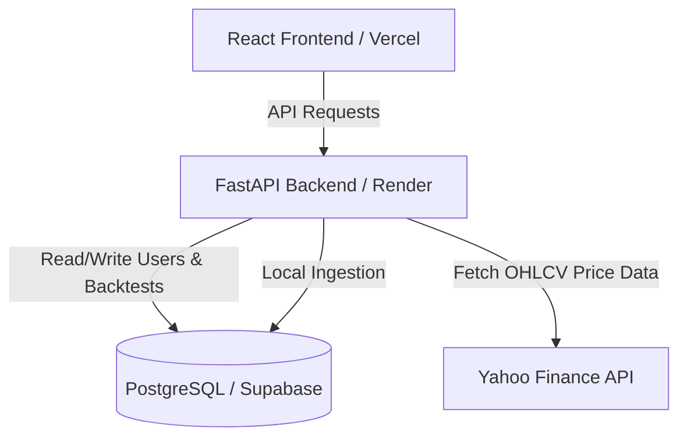

# 📈 BackTestii: Quantitative Backtesting Terminal

**BackTestii** is a modern, high-performance web terminal built to backtest, analyze, and optimize quantitative trading strategies on the Indian equity markets (NSE & BSE).

Designed as an institutional-grade portfolio project, it bridges a fast **FastAPI (Python)** computational engine with an interactive, responsive **React (Vite)** dashboard, backed by a persistent **PostgreSQL (Supabase)** database.

---

## 🚀 Key Features

* **Vectorized Backtesting Engine**: Calculate key trading metrics instantly:
  * **Performance**: Total Return, CAGR, Expectancy, and Win Rate.
  * **Risk Metrics**: Maximum Drawdown (MDD), Max Drawdown Duration, Average Loss, and Average Holding Time.
* **Interactive Charting Dashboard**: Built with high-performance time-series visualization using lightweight charts for smooth zoom/pan interaction.
* **Modular Strategy Registry**: Clean Python interfaces that let you write and plug in custom mathematical or technical indicator strategies (e.g., *Buy & Hold*, *EMA Crossover*, *Mean Reversion*).
* **Automated Data Ingestion**: Dual-source configuration supporting on-the-fly execution via **Yahoo Finance API** or locally cached DB pipelines.
* **Persistent Sessions**: User registries, strategy parameters, and historical backtests are saved and tracked via a managed database.

---

## 🏗️ Architecture & Tech Stack



* **Frontend**: React 19, Vite, Lightweight Charts (Financial Charting), Lucide React (Icons), Custom Responsive Vanilla CSS.
* **Backend**: FastAPI, SQLAlchemy (ORM), Pydantic (Data validation), Uvicorn, Pandas & NumPy (Vectorized analysis).
* **Database**: PostgreSQL (hosted on Supabase) utilizing connection pooling for high availability.
* **Hosting**: Automated CI/CD deployment using **Vercel** (Frontend) and **Render** (Backend).

---

## 📂 Project Structure

```
├── backend/               # FastAPI Application
│   ├── models/            # SQLAlchemy Database Models
│   ├── routers/           # API Endpoint Declarations
│   └── services/          # Backtesting Strategy Executors
├── engine/                # Core Computational Engine
│   ├── analytics/         # Mathematical Metrics Calculations
│   ├── data/              # Ingestion Pipelines (Bhavcopy, Yahoo Finance)
│   └── execution/         # Trade Logic Simulation Engine
├── frontend/              # Vite + React Single Page Application
│   ├── src/
│   │   ├── api/           # HTTP Client configuration
│   │   ├── components/    # Reusable UI Elements (Sidebar, Charts, Tables)
│   │   └── data/          # Strategy & Metric explanations
└── data/                  # Ingestion templates & listed tickers (NSE/BSE)
```

---

## ⚙️ Local Development Setup

### 1. Backend Configuration
1. Navigate to the project root and create a Python virtual environment:
   ```bash
   python -m venv .venv
   .venv\Scripts\activate
   ```
2. Install the dependencies:
   ```bash
   pip install -r requirements.txt
   ```
3. Create a `.env` file in the root directory:
   ```env
   DATABASE_URL=postgresql+psycopg://your_db_credentials
   SECRET_KEY=your_secret_key_string
   ALGORITHM=HS256
   INTERNAL_CLIENT_KEY=backtestii_internal_secret_key_2026
   DATA_SOURCE=yahoo
   ```
4. Start the FastAPI development server:
   ```bash
   uvicorn backend.main:app --reload --port 8000
   ```

### 2. Frontend Configuration
1. Navigate to the `frontend` directory:
   ```bash
   cd frontend
   ```
2. Install Node packages:
   ```bash
   npm install
   ```
3. Start the Vite development server:
   ```bash
   npm run dev
   ```
4. Open [http://localhost:5173](http://localhost:5173) in your browser.

---

## ☁️ Production Deployment

The project is fully pre-configured for automated Git-based deployment on free-tier cloud environments:

* **Database (Supabase)**: Transaction/Session pooling configured on port `6543` to facilitate IPv4 access.
* **Backend (Render)**: Set to compile via `requirements.txt` and run on `uvicorn` using custom CORS policies.
* **Frontend (Vercel)**: Pointed directly to the `frontend` subdirectory, building statically and binding to the production API domain via the `VITE_API_URL` environment variable.

---

## 🔮 Future Roadmap

* [ ] **Options Backtesting Engine**: Incorporate Option Chain Ingestion, Greek calculations (Delta, Theta, Vega), and multi-leg options strategy simulations.
* [ ] **Candlestick Pattern Recognition**: Algorithmic scanner to detect and backtest classic price patterns (Engulfing, Doji, Hammer).
* [ ] **Portfolio Correlation Analyzer**: Backtest multi-asset portfolios to optimize beta exposure and Sharpe Ratio.
